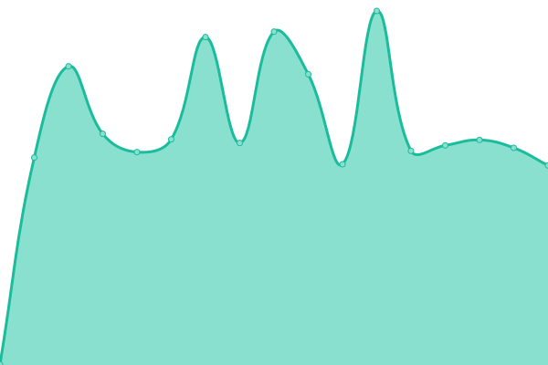

# [📈 Live Status](https://status.yuni.su): <!--live status--> **🟧 Partial outage**

<!--start: status pages-->
<!-- This summary is generated by Upptime (https://github.com/upptime/upptime) -->
<!-- Do not edit this manually, your changes will be overwritten -->
<!-- prettier-ignore -->
| URL | Status | History | Response Time | Uptime |
| --- | ------ | ------- | ------------- | ------ |
|  [Landing about me – yuni.su](https://yuni.su) | 🟩 Up | [landing-about-me-yuni-su.yml](https://github.com/itsyuni/uptime/commits/HEAD/history/landing-about-me-yuni-su.yml) | 

 434ms
     
 | 

<a href="https://status.yuni.su/history/landing-about-me-yuni-su">100.00%</a>
    

|  [Home dedicated Raspberry Pi 3 + home network center](https://rpi.yuni.su) | 🟥 Down | [home-dedicated-raspberry-pi-3-home-network-center.yml](https://github.com/itsyuni/uptime/commits/HEAD/history/home-dedicated-raspberry-pi-3-home-network-center.yml) | 

 638ms
     
 | 

<a href="https://status.yuni.su/history/home-dedicated-raspberry-pi-3-home-network-center">98.14%</a>
    

|  [Paralone Media – Landing](https://paralonemedia.com) | 🟩 Up | [paralone-media-landing.yml](https://github.com/itsyuni/uptime/commits/HEAD/history/paralone-media-landing.yml) | 

 2281ms
     
 | 

<a href="https://status.yuni.su/history/paralone-media-landing">100.00%</a>
    

|  [Paralone Media – Workspace for artists](https://my.paralonemedia.com) | 🟩 Up | [paralone-media-workspace-for-artists.yml](https://github.com/itsyuni/uptime/commits/HEAD/history/paralone-media-workspace-for-artists.yml) | 

 274ms
     
 | 

<a href="https://status.yuni.su/history/paralone-media-workspace-for-artists">100.00%</a>
    

|  [Paralone Media – API Workspace](https://api.paralonemedia.com) | 🟩 Up | [paralone-media-api-workspace.yml](https://github.com/itsyuni/uptime/commits/HEAD/history/paralone-media-api-workspace.yml) | 

 391ms
     
 | 

<a href="https://status.yuni.su/history/paralone-media-api-workspace">100.00%</a>
    

|  [Paralone Media – OAuth Workspace](https://auth.paralonemedia.com/login?next=https://my.paralonemedia.com/account/oauth-login) | 🟩 Up | [paralone-media-o-auth-workspace.yml](https://github.com/itsyuni/uptime/commits/HEAD/history/paralone-media-o-auth-workspace.yml) | 

 271ms
     
 | 

<a href="https://status.yuni.su/history/paralone-media-o-auth-workspace">100.00%</a>
    

<!--end: status pages-->
